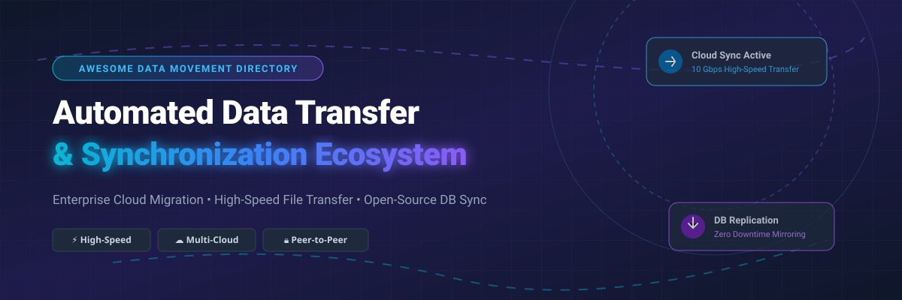

# Awesome Automated Data Transfer & Synchronization 🔄 ☁️ 🚀

  

  
  
  
  
  

---

## 🌟 Overview & Top Automated Data Transfer & Synchronization Ecosystem 🌐

Welcome to the definitive curated index of **automated data transfer solutions**, **enterprise data migration platforms**, **real-time database replication engines**, and **open-source file synchronization utilities**. 💡

This repository provides comprehensive benchmark details, commercial pricing models, free tier/trial boundaries, enterprise valuation metrics, and open-source Stars_Counts for software engineers, cloud architects, IT infrastructure administrators, and data engineering teams. 📊

**Key Coverage Categories:**
- ☁️ **Cloud Migration & Hybrid Storage Sync**: AWS DataSync, Azure Data Factory, Google Transfer Appliance, Rclone, Chorus.
- ⚡ **High-Speed Enterprise File Movement**: IBM Aspera (FASP), Signiant, Resilio Connect (P2P), Atempo Miria.
- 🔄 **Real-Time & Peer-to-Peer Synchronization**: Syncthing, Unison, SymmetricDS, Seafile, Nextcloud.
- 🛡️ **Encrypted Cloud Backup & Archiving**: Restic, Kopia, BorgBackup, Duplicati, FreeFileSync, Cyberduck.

**Last updated: October 2026** 📅

---

## 📑 Table of Contents 📌
- [🏢 SaaS & Commercial Platforms](#-saas--commercial-platforms)
- [🔓 Open-Source GitHub Projects](#-open-source-github-projects)
- [🛠️ How to Contribute](#%EF%B8%8F-how-to-contribute)
- [🤝 Support & Sponsorship](#-support--sponsorship)
- [⚠️ Disclaimer](#%EF%B8%8F-disclaimer)
- [📊 Star History](#-star-history)

---

## 🏢 SaaS & Commercial Platforms 💼

> **Market Insights & Industry Structure:** 📈  
> The global data transfer and automated migration software market size is estimated at **$11.8 Billion** and is projected to expand at a CAGR of 12.4%. The sector exhibits a **highly fragmented market structure**, divided between public cloud hyperscalers (Microsoft Azure, AWS, Google Cloud) offering serverless infrastructure integration, legacy enterprise storage giants (IBM Aspera, Atempo), and specialized high-speed media transfer networks (Signiant, Resilio).

*Sorted by Company Valuation / Market Capitalization (Descending)* 📊

| SaaS / Commercial Platform | Company / Owner | Valuation / Market Cap | Standard Edition Starting Price | Free Tier / Free Trial Limits | Description |
| :--- | :--- | :--- | :--- | :--- | :--- |
| **[Azure Data Factory](https://azure.microsoft.com/en-us/products/data-factory/)** 🔷 | Microsoft | ~$3.90 Trillion | $0.25 per DIU-hour for Copy activities; $1.00/hour for orchestration | 1,000 free activity runs/month for 12 months with Azure Free Account | **Cloud data integration & orchestration** — Serverless ETL and data movement service. Copy tasks scale via Data Integration Units (DIU) with pipeline scheduling. |
| **[AWS DataSync](https://aws.amazon.com/datasync/)** ☁️ | Amazon | ~$2.00 Trillion | $0.0125 per GB transferred | 10 GB free trial usage per month under AWS Free Tier | **Automated cloud data transfer** — High-performance agent-based data movement between on-premises NFS/SMB storage and AWS S3, EFS, and FSx. |
| **[Google Transfer Appliance](https://cloud.google.com/transfer-appliance/)** 🌐 | Google (Alphabet) | ~$2.00 Trillion | $300 base shipping fee (TA40 model) + $30/day extra usage | 10 free usage days included for TA40 model (30 free days for TA300) | **Physical hardware migration appliance** — High-capacity secure storage hardware shipped to data centers for offline terabyte/petabyte migration to Google Cloud. |
| **[IBM Aspera](https://www.ibm.com/products/aspera)** 🚀 | IBM | ~$200 Billion | $0.95 per GB transferred (On-Demand SaaS tier) | 30-day full access free trial with 100 GB transfer volume limit | **High-speed FASP protocol transfer** — Patented WAN acceleration protocol bypassing TCP bottlenecks for mass enterprise datasets and media files. |
| **[Signiant](https://www.signiant.com/)** 📡 | Signiant Inc. | ~$350 Million (Private) | $13,000/year (Signiant Jet base tier for small teams) | 14-day enterprise free trial with up to 500 GB transfer allocation | **Media & enterprise cloud data transfer** — SaaS acceleration platform for automated multi-site file movement across hybrid cloud storage environments. |
| **[Resilio Connect](https://www.resilio.com/)** ⚡ | Resilio Inc. | ~$150 Million (Private) | $7,500/year (Base management server + 10 endpoints) | 30-day unlimited trial for up to 50 active sync endpoints | **Peer-to-peer file synchronization** — BitTorrent protocol-based block-level synchronization software optimized for low-bandwidth, high-latency enterprise links. |
| **[CTERA](https://www.ctera.com/)** 📁 | CTERA Networks | ~$120 Million (Private) | $12,000/year (Enterprise Gateway subscription) | 30-day evaluation trial with 1 TB cloud portal storage limit | **Edge-to-cloud file services** — Enterprise global namespace and file synchronization connecting edge filers to centralized cloud object storage. |
| **[Komprise](https://www.komprise.com/)** 💰 | Komprise Inc. | ~$100 Million (Private) | $261/TB over 3-year subscription license | 30-day free trial with data assessment scan up to 100 TB | **Intelligent data management & tiering** — Analyzes unstructured NAS/object storage and transparently transfers cold data to low-cost cloud tiers. |
| **[Atempo Miria](https://www.atempo.com/)** 🗄️ | Atempo | ~$75 Million (Private) | $15,125/month for 100 TB migration license package | 14-day enterprise proof-of-concept trial up to 10 TB transfer | **Large-scale file migration & archiving** — High-performance data movement software engineered for multi-petabyte unstructured storage and media workflows. |
| **[Datadobi](https://www.datadobi.com/)** 📊 | Datadobi | ~$50 Million (Private) | $1.00 per license unit/month (StorageMAP module) | 30-day trial with initial NAS discovery scan up to 50 TB | **Unstructured data migration & governance** — Enterprise platform for enterprise NAS-to-NAS and NAS-to-Object migration with full ACL metadata retention. |

---

## 🔓 Open-Source GitHub Projects 🛠️

*Sorted by GitHub_Stars_Count (Descending)* 🌟

- **[Syncthing](https://github.com/syncthing/syncthing)**   
  **Continuous peer-to-peer file synchronization**, MPL-2.0 licensed. Decentralized, secure continuous file sync tool that replaces proprietary cloud sync services. Encrypted in transit with TLS, automatic device discovery, and zero central server dependency. Runs on Linux, macOS, Windows, Android, and BSD.  📂

- **[Rclone](https://github.com/rclone/rclone)**   
  **The Swiss army knife of cloud storage sync**, MIT licensed. Powerful CLI program to sync files and directories to and from over 70 cloud storage providers (S3, Google Drive, OneDrive, SFTP, WebDAV, etc.). Features bi-directional sync, bandwidth control, encryption, multi-thread transfers, and FUSE mount support.  🔄

- **[restic](https://github.com/restic/restic)**   
  **Fast, secure, and efficient backup/sync program**, BSD-2-Clause licensed. Secure backup software that uses cryptography to guarantee confidentiality and integrity. Features chunk-based deduplication, cross-platform support, and native support for local storage and major cloud backends.  ⚡

- **[Nextcloud Server](https://github.com/nextcloud/server)**   
  **Self-hosted enterprise file sync and content collaboration**, AGPL-3.0 licensed. Full-featured self-hosted file sync platform with enterprise sharing permissions, desktop/mobile client auto-sync, end-to-end encryption, and extensible app ecosystem.  ☁️

- **[Seafile](https://github.com/haiwen/seafile)**   
  **High-performance file sync and cloud storage**, AGPL-3.0 licensed. Reliable open-source file sync and share solution with fast delta sync algorithms. Offers library encryption, file versioning, drive mounting, and multi-platform client apps.  🗂️

- **[BorgBackup](https://github.com/borgbackup/borg)**   
  **Deduplicating authenticated backup and sync software**, BSD-3-Clause licensed. High-efficiency deduplicating sync and backup tool. Provides authenticated AES-256 encryption, client-side compression (lz4, zstd), and SSH remote storage support.  🗜️

- **[Duplicati](https://github.com/duplicati/duplicati)**   
  **Encrypted cloud backup & incremental file sync**, LGPL-2.1 licensed. Free client software that securely stores encrypted, incremental, compressed backups on cloud storage services and remote file servers with a web-based UI.  🔐

- **[Kopia](https://github.com/kopia/kopia)**   
  **Fast and secure open-source backup/sync engine**, Apache-2.0 licensed. Cross-platform backup tool providing end-to-end encryption, deduplication, compression, and snapshot management with CLI and GUI interfaces.  🛡️

- **[Cyberduck](https://github.com/iterate-ch/cyberduck)**   
  **Libre cloud storage browser & data transfer client**, GPL-3.0 licensed. Popular open-source cloud storage browser supporting FTP, SFTP, WebDAV, Amazon S3, OpenStack Swift, Backblaze B2, and Google Drive synchronization.  🦆

- **[SymmetricDS](https://github.com/JumpMind/symmetric-ds)**   
  **Database replication and file synchronization engine**, GPL-3.0 licensed. Multi-master database replication and file synchronization platform. Supports heterogeneous database sync across low-bandwidth networks (MySQL, PostgreSQL, Oracle, SQL Server, SQLite).  🔗

- **[FreeFileSync](https://github.com/FreeFileSync/FreeFileSync)**   
  **Folder comparison and file synchronization application**, GPL-3.0 licensed. Open-source folder comparison and sync tool optimized for local drives, network shares, and SFTP endpoints with visual diffing and batch job automation.  📂

- **[rsync](https://github.com/RsyncProject/rsync)**   
  **Classic delta-transfer incremental sync utility**, GPL-3.0 licensed. The benchmark UNIX utility for efficient incremental file transfer using rolling checksum algorithm over SSH or raw TCP sockets.  📦

- **[Unison](https://github.com/bcpierce00/unison)**   
  **Bi-directional file synchronization tool for Unix and Windows**, GPL-3.0 licensed. Enterprise-proven file synchronizer that allows two copies of a collection of files and directories to be updated independently and merged smoothly.  🔁

- **[Chorus](https://github.com/clyso/chorus)**   
  **Distributed S3 object storage migration and sync engine**, Apache-2.0 licensed. Modern high-throughput S3 replication tool designed for multi-cloud object storage migrations, live bucket mirroring, and background data synchronization.  🎯

- **[rclone-webui-react](https://github.com/rclone/rclone-webui-react)**   
  **React Web UI for Rclone CLI engine**, MIT licensed. Official React front-end interface for monitoring, configuring, and managing active Rclone transfers and remote mounts.  🖥️

---

## 🛠️ How to Contribute 🤝

Contributions are highly appreciated! To submit new enterprise data transfer software, high-speed protocols, or open-source synchronization tools:

1. 🍴 **Fork** this repository.
2. 📝 **Add or edit** entries in `README.md` respecting table/list formatting rules and alphabetical or numerical sort order.
3. 🔗 Include official homepage/GitHub repository URLs, exact standard pricing details, free tier limits, company valuation metrics, and stargazer badges.
4. 🚀 Open a **Pull Request** detailing your additions.

---

## 🤝 Support & Sponsorship 🙏

Thank you for visiting and using this curated directory! If this project aids your infrastructure design, data engineering, or software research, please consider supporting us:

- ⭐ **Star** this repository to increase visibility and help others discover it!
- 🔀 **Fork & Share** with fellow developers, cloud architects, and sysadmins.
- ☕ **Buy Me a Coffee / Sponsor**: Support ongoing open-source curation and project maintenance via the [GitHub Sponsor Dashboard](https://github.com/sponsors/ishandutta2007).

---

## ⚠️ Disclaimer 🔒

- This list is **community-curated** for educational and architectural reference only. ℹ️
- Data transfer engines process sensitive enterprise assets. Always verify end-to-end encryption standards (AES-256, TLS 1.3), network security posture, SOC2 compliance, and regulatory data residency requirements prior to deployment. 🔒
- Commercial tools (IBM Aspera, Signiant) offer enterprise SLAs and dedicated acceleration protocols, whereas open-source projects (Rclone, Syncthing, Chorus) provide self-hosted control and zero licensing fees. 🔄

---

## 📊 Star History

---

  <b>Made with ❤️ for cloud architects, data engineers, and open-source synchronization advocates.</b>

